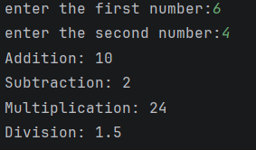
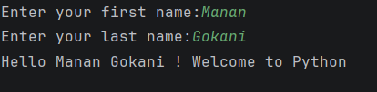

Project Overview

This project contains two simple Python programs designed to demonstrate basic input handling, arithmetic operations, and string manipulation. It is ideal for beginners who are learning Python fundamentals.

 
Task 1: Basic Mathematical Operations 
Description-
This program takes two numbers as input from the user and performs the following mathematical operations:
Addition
Subtraction
Multiplication
Division
The results of each operation are then displayed on the screen.
Features
User-friendly input prompts
Handles basic arithmetic calculations
Displays clear and readable output
Output:

Task 2: Personalized Greeting 
Description
This program takes the user's first name and last name as input, combines them into a full name, and prints a personalized greeting message.
 Features
Accepts string input from the user
Demonstrates string concatenation
Outputs a friendly greeting
Output:
